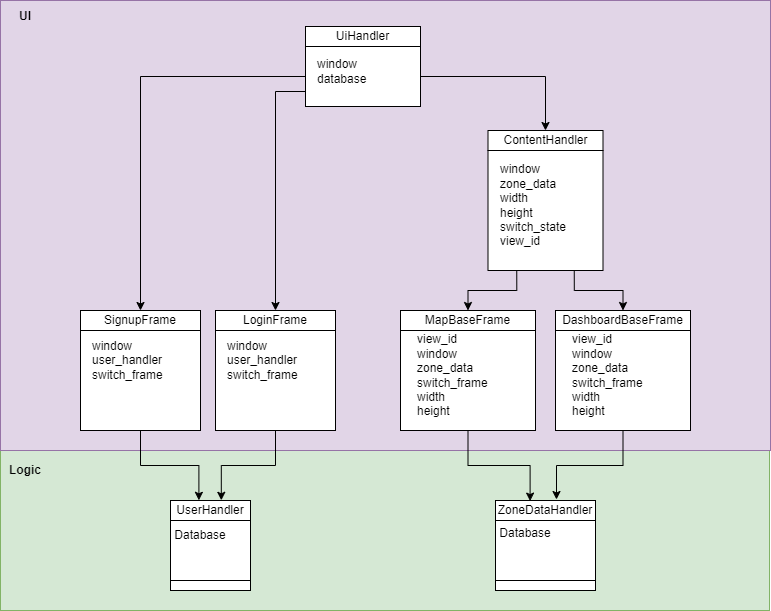
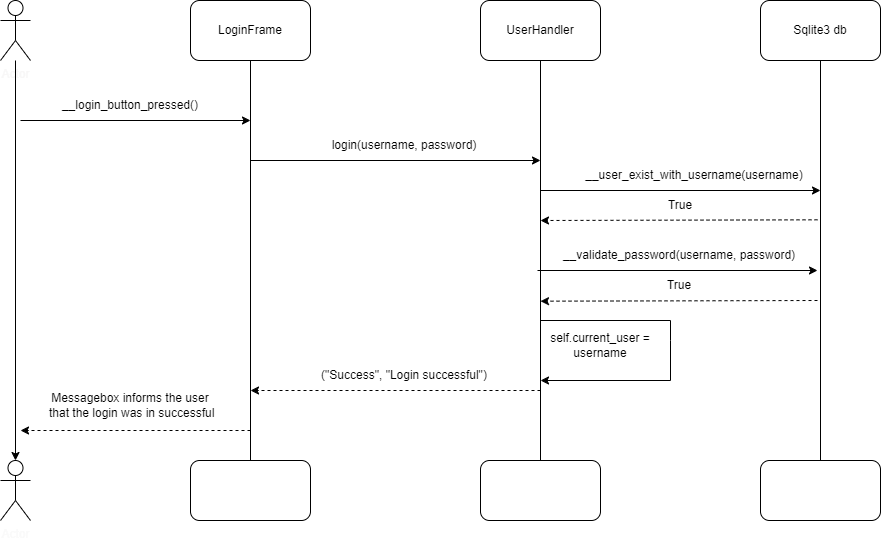
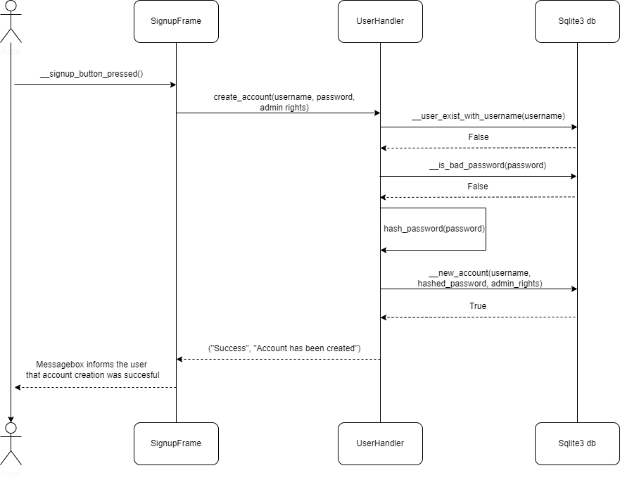

## Program Architecture

### Build
The build of the program looks currently like this, a three-tier monolithic architecture. 

- *UI* is the graphical user interface
- *logic* is the logic of the program 
- *database* is where the data is saved. 
#### Program logic

### Login architecture

### Signup architecture

