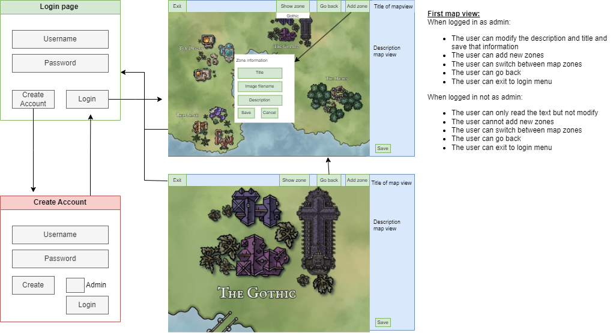

## Functional requirements

*The functional requirements file's aim is to give an overview of the program, the users, the user interface, and the functionalities of the program.*

### The purpose
---

The aim of this program is to aid the process of game development. The main feature of this program is the ability to add information to a conceptual game map. The map data may consist of location information, lore, geographical information, information about the NPCs (non-playable characters), extra map layers, etc. In the current stage, the user can add information about the location in the dashboard and view different zones.  

### The users
---
There will be both an admin and a normal user, where the admin will have the right to do any modification while the normal user cannot modify anything. 

### The user Interface (UI)
---
The program has three main views; the login page, the create account page, and the map page.

The program starts from the login page, if the user doesn't have an account, the user will have to create an account before logging in, and there the user can select if the user is an admin or not (This is just here to showcase the functionality of admin rights, if it was a program, the user would not have this option). After the user has logged in, the map page is seen with a dashboard to the right and a toolbar at the top of the window.

When logged in as admin:
- The user can modify the description and title and save that information
- The user can add new zones
- The user can switch between map zones
- The user can go back
- The user can exit to the login menu
  
When logged in not as admin:
- The user can only read the text but not modify
- The user cannot add new zones
- The user can switch between map zones
- The user can go back
- The user can exit to the login menu
  

### The basic functionalities
---

#### Before login
- [x] When the program is opened, the user is greeted by a login page
- [x] On the login page, the user can create an account or log in if the user already has an account
- [x] When creating an account, it checks whether the username or password exists and if not, the creation is successful. The user can check the box to become an admin.  
- [x] The user can log in by adding their username and password. If the username or password is wrong or cannot be found, then a message about that will appear

#### After login
- [x] The user sees the first map page which is the most zoomed-out map view of the game map. On the right side of the page, there is a dashboard where information added to the map is viewed.
- [x] When pressing **add zone** button on the bar, the user can add a new zone.
- [x] When pressing **show zones** on the bar, the user can choose which zone to show by selecting a zone from the dropdown menu.
- [x] **Go back** button returns to the parent map page.  
- Example object that can be added to the map:
  * Information about a certain place
  * A short story/ lore about a location
  * Quests
 
- [x] After the user is ready with whatever, the user can **exit map view** and return to the login page. 

### The advanced functionalities
---
Unfortunately, I did not have time during the course to add all these advanced functionalities but as this program is part of a bigger project that I am in, I will continue developing it in my spare time and then, add all the below functionalities and more :) 
- Further development of the program could be
  * Adding of NPCs
  * Additional map layers
  * If the user hovers over an object with the mouse, the name of the object appears.

### The technologies used
---

This program will be developed using Visual Studio Code as editor and Python as the programming language. Windows is the operative system but it will be ensured that the program also works on the Linux operative system. Sqlite3 is used for data storage.

Other dependencies: 
- Custom tkinter
- bcrypt
- pillow
- autopep8
- pylint
- pytest
- packaging
- invoke

