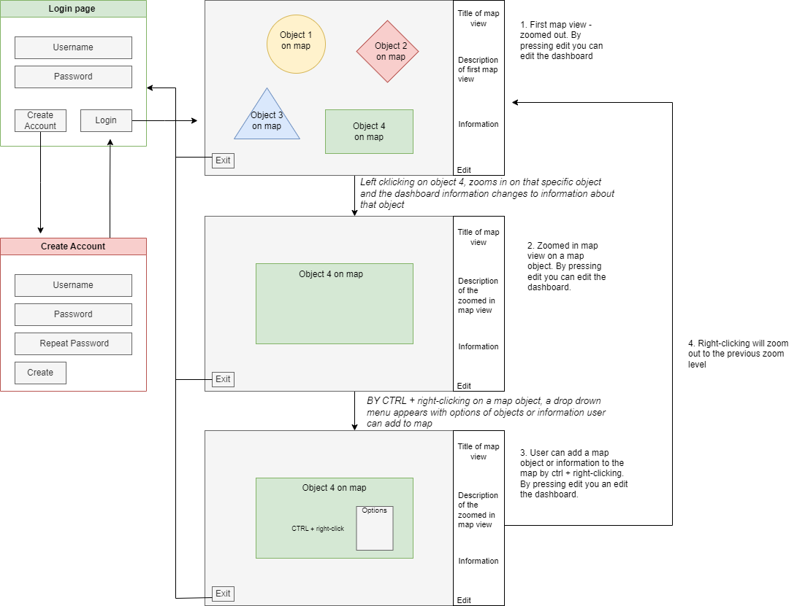

## Functional requirements

*The functional requirements file's aim is to give an overview of the program, the users, the user interface, and the functionalities of the program.*

### The purpose
---

The aim of this program is to aid the process of game development. The main feature of this program is the ability to add information to a conceptual game map. The map data may consist of location information, information about the NPCs (non-playable characters), extra map layers, etc. 

### The users
---
There will be both an admin and a normal user, where the admin will have the right to do anything while the normal user's modification rights are limited. The admin can delete normal users and has access to program statistics.

### The user Interface (UI)
---
The program has three main views; the login page, the create account page, and the map page. By zooming in and out on the map page, new map pages appear. 

The program starts from the login page, if the user doesn't have an account, the user will have to create an account before logging in. After the user has logged in, the map page is seen with a dashboard to the right. By left-clicking the user can zoom in, by ctrl + right-clicking the user can add an object to the map, and by right-clicking the user can zoom out. To edit the dashboard, the user can press the edit button to change the information on the dashboard. The information on the dashboard corresponds to the object that is viewed on the map. To exit the program the user can press the exit button which takes the user back to the login page. 

### The basic functionalities
---

#### Before login
- [x] When the program is opened, the user is greeted by a login page
- [x] On the login page, the user can create an account or log in if the user already has an account
- [x] The user can log in by adding their username and password. If the username or password is wrong or cannot be found, then a message about that will appear

#### After login
- [x] The user sees the first map page which is the most zoomed-out map view of the game map. On the right side of the page, there is a dashboard where information added to the map is viewed.
- [x] (EDIT: When pressing **add zone** button on the bar, the user can add a new zone.) By mouse left-clicking, the map view zooms in on the particular place where the mouse is, and by mouse right-clicking, the map view zooms out.
- [x] (EDIT: When pressing **show zones** on the bar, the user can choose which zone to show by selecting a zone from the dropdown menu.) By ctrl + right-click on a specific spot on the map, a drop-down menu appears which states the objects that can be added to the map on that location.
Example object that can be added to the map:
  * Information about a certain place
  * A short story/ lore about a location
  * Quests

- Also, additional map layers containing specific information can be layered on the base map. The base map and the additional layers are not made in the program, they are imported into the program and made in a different software.
- If the user hovers over an object with the mouse, the name of the object appears. 
- After the user is ready to add something or just view, the user can log out and thus the page is returned the the login page. 

### The advanced functionalities
---
- Further development of the program could be
  * Adding of NPCs
  * Additional map layers

### The technologies used
---

This program will be developed using Visual Studio Code as editor and Python as the programming language. Windows is the operative system but it will be ensured that the program also works on the Linux operative system. PostgreSQL will most likely be used for data storage.

Other dependencies: 
- ?

