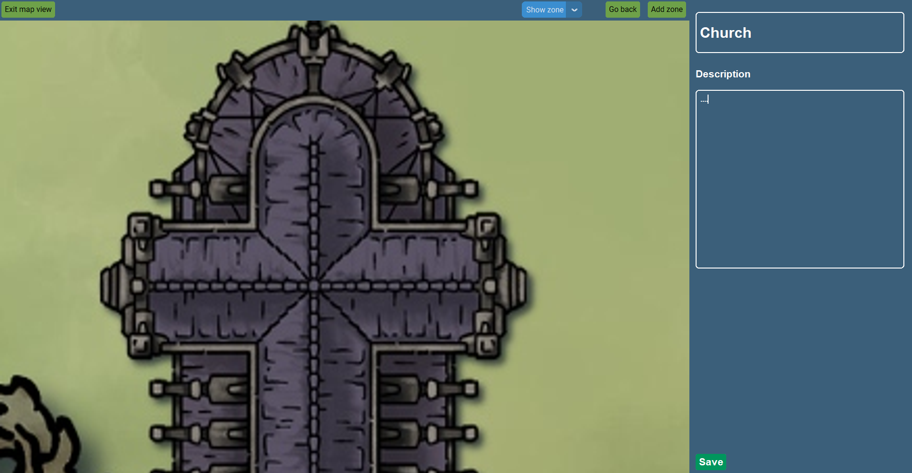

## Instructions

To run this program either, clone this repository or download the latest release. 

#### 1. Clone the repository
```
git clone https://github.com/micsoder/ot-harjoitustyo.git
```

#### 2. Go to the directory
```
cd ot-harjoitustyo
```

#### 3. Install the dependencies from Poetry
```
poetry install
```

#### 4. Set the virtual environment
```
poetry shell
```

#### 5. Start the program by running 
```
poetry run invoke start
```

### Login in
When running the program, the first thing the user sees is the login page, if the user already has an account, the user can log in, otherwise, the user should go to the signup page. 


### Sign up 
Create an account by selecting a username and password, press "create account" and then return to the login page for logging in. By selecting admin, the user will have admin rights which means that the user can modify text and add new zones. If the user is without admin rights, then the user cannot modify any text and cannot add new zones, only view the content.


### Main view 
This is the main view that the user is greeted with. The dashboard information can be modified and changed and by pressing save, the information is saved into the database. 


### Add zone 
By pressing "add zone", the user can add a new zone by adding a title, image filename, and a short description. By clicking "save", the information is saved into a database and by clicking "cancel", the information frame is destroyed. 


### Show zone
By pressing "show zone", the user can select the zones which have been added by the user, and the map view changes to that zone image and its dashboard. Here once more, the user can modify and change the dashboard information. 


### Add/Show zone 
Within each added zone, new zones can be added by pressing "add zone" and then "show zone" to go within that zone. 



### Go back
By pressing "Go back", the user goes back to the parent map from where the user has zoomed in. 


### Go back
Once the user has gone back to the main view, from here the user can't go back as this is the parent map zone of all map zones. 


### Exit map view
By clicking "Exit map view", the user is returned to the login page 


