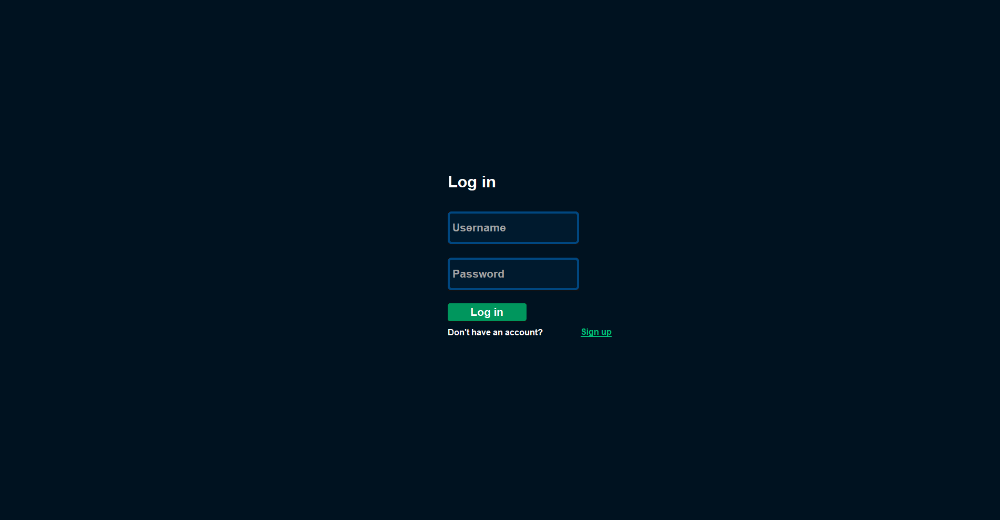
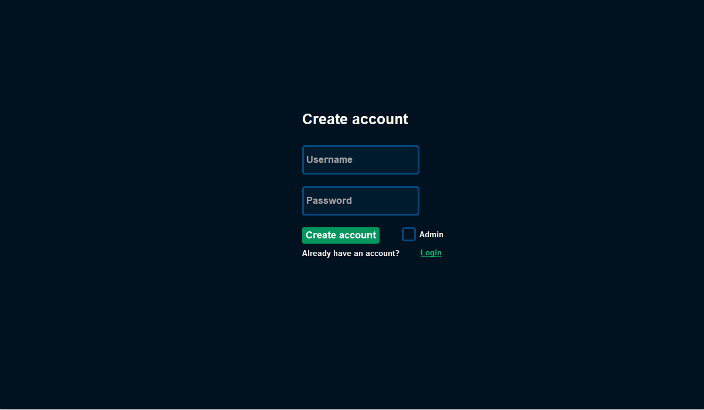
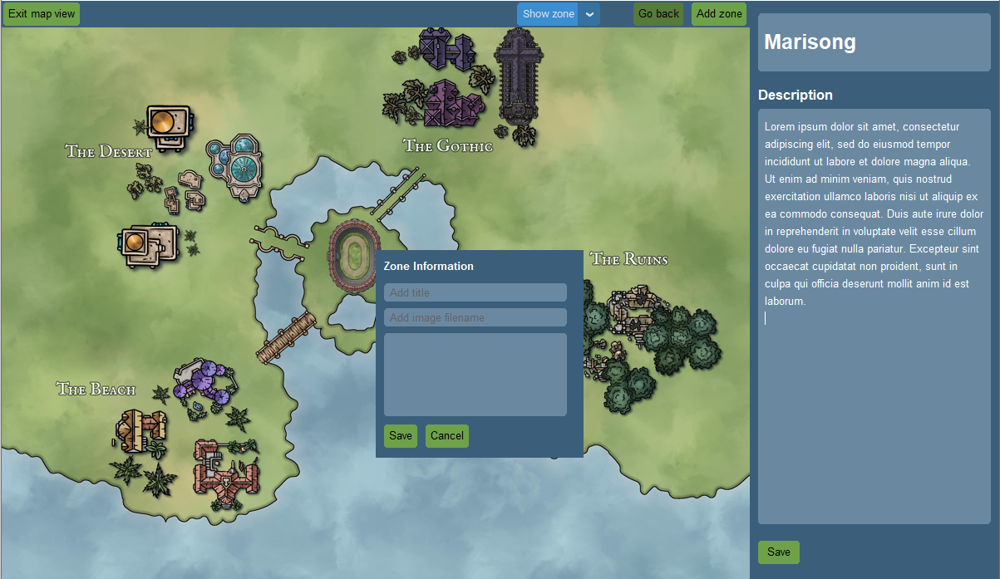

## Instructions

To run this program either, clone this repository or download the latest release. 

#### 1. Install the dependencies from Poetry
```
poetry install
```

#### 2. Set the virtual environment
```
poetry shell
```

#### 3. Start the program by running 
```
poetry run invoke start
```

### Login in


### Sign up 


### Main view 


### Add zone 



### Show zone


### Go back


