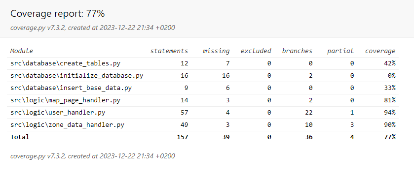

# Documentation of tests

The program has been tested with unit tests and integration tests using the pytest unittest.

I have mainly focused on the ZoneDatahandler, UserHandler, and MapPageHandler classes as those classes build up most of the logic in the program.

### ZoneDataHandler tests
The ZoneDataHandler handles everything with the zone data so I did various unit tests on fetching and adding zone data as well as a couple of integration tests with the MapPapehandler. 

### UserHandler tests
The UserHandler handles everything with user data so I did various unit tests to add correct and incorrect usernames and passwords etc. The UserHandler class fetches and adds data to the user table so the CreateTables class was a bit tested consequently.

### Coverage report
The programs coverage is 77% when not taking the below into consideration: 

```
omit = src/**/__init__.py,src/tests/**,src/ui/**,src/index.py,src/main.py
```



Due to time constraints, I was not able to get the coverage percentage higher.

### Installation

The program has been tested on both Linux and Windows and work well on both.

### Functionality

I have also done some manual testing in the GUI as I have tried to add incorrect or left entries empty, the program reacts well to these situations accordingly. 

