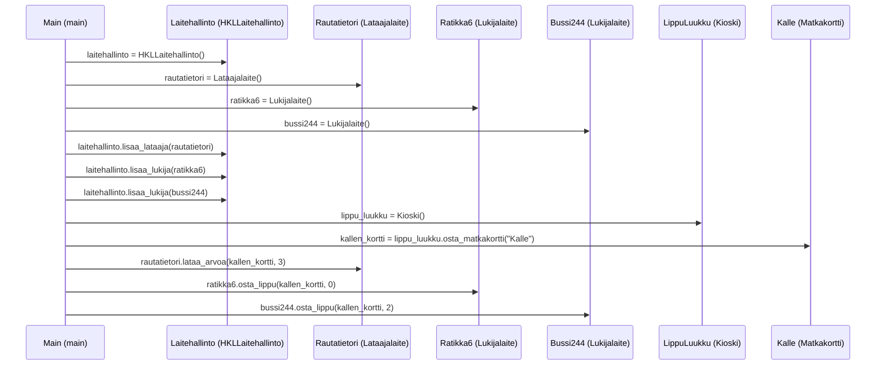

```mermaid
sequenceDiagram
    participant Main as Main (main)
    participant Laitehallinto as Laitehallinto (HKLLaitehallinto)
    participant Rautatietori as Rautatietori (Lataajalaite)
    participant Ratikka6 as Ratikka6 (Lukijalaite)
    participant Bussi244 as Bussi244 (Lukijalaite)
    participant LippuLuukku as LippuLuukku (Kioski)
    participant Kalle as Kalle (Matkakortti)

    Main ->> Laitehallinto: laitehallinto = HKLLaitehallinto()
    Main ->> Rautatietori: rautatietori = Lataajalaite()
    Main ->> Ratikka6: ratikka6 = Lukijalaite()
    Main ->> Bussi244: bussi244 = Lukijalaite()
    Main ->> Laitehallinto: laitehallinto.lisaa_lataaja(rautatietori)
    Main ->> Laitehallinto: laitehallinto.lisaa_lukija(ratikka6)
    Main ->> Laitehallinto: laitehallinto.lisaa_lukija(bussi244)
    Main ->> LippuLuukku: lippu_luukku = Kioski()
    Main ->> Kalle: kallen_kortti = lippu_luukku.osta_matkakortti("Kalle")
    Main ->> Rautatietori: rautatietori.lataa_arvoa(kallen_kortti, 3)
    Main ->> Ratikka6: ratikka6.osta_lippu(kallen_kortti, 0)
    Main ->> Bussi244: bussi244.osta_lippu(kallen_kortti, 2)
```
