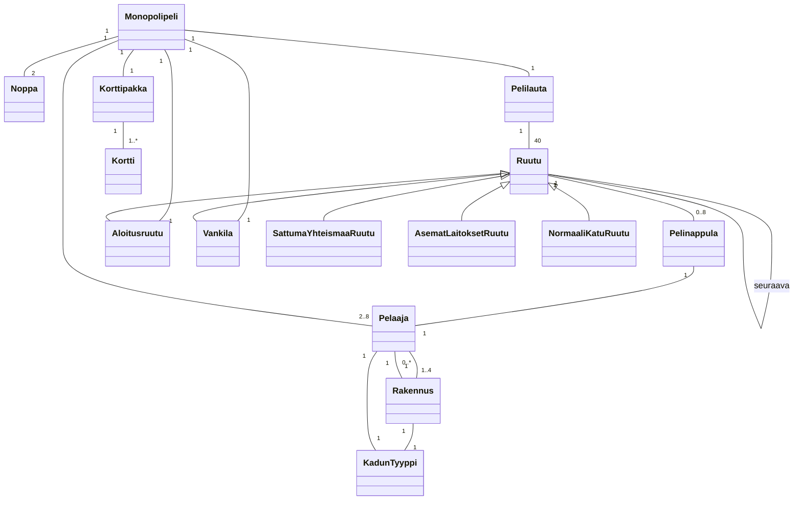

```mermaid
classDiagram
    Monopolipeli "1" -- "2" Noppa
    Monopolipeli "1" -- "1" Pelilauta
    Pelilauta "1" -- "40" Ruutu
    Ruutu "1" -- "1" Ruutu : seuraava
    Ruutu "1" -- "0..8" Pelinappula
    Pelinappula "1" -- "1" Pelaaja
    Pelaaja "2..8" -- "1" Monopolipeli
    Monopolipeli "1" -- "1" Aloitusruutu
    Monopolipeli "1" -- "1" Vankila
    Monopolipeli "1" -- "1" Korttipakka
    Korttipakka "1" -- "1..*" Kortti
    Ruutu <|-- Aloitusruutu
    Ruutu <|-- Vankila
    Ruutu <|-- SattumaYhteismaaRuutu
    Ruutu <|-- AsematLaitoksetRuutu
    Ruutu <|-- NormaaliKatuRuutu
    Pelaaja "0..*" -- "1..4" Rakennus
    Rakennus "1" -- "1" KadunTyyppi
    KadunTyyppi "1" -- "1" Pelaaja
    Rakennus "1" -- "1" Pelaaja
```
